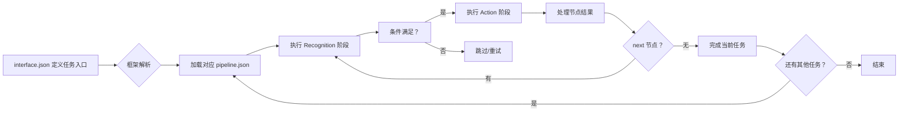
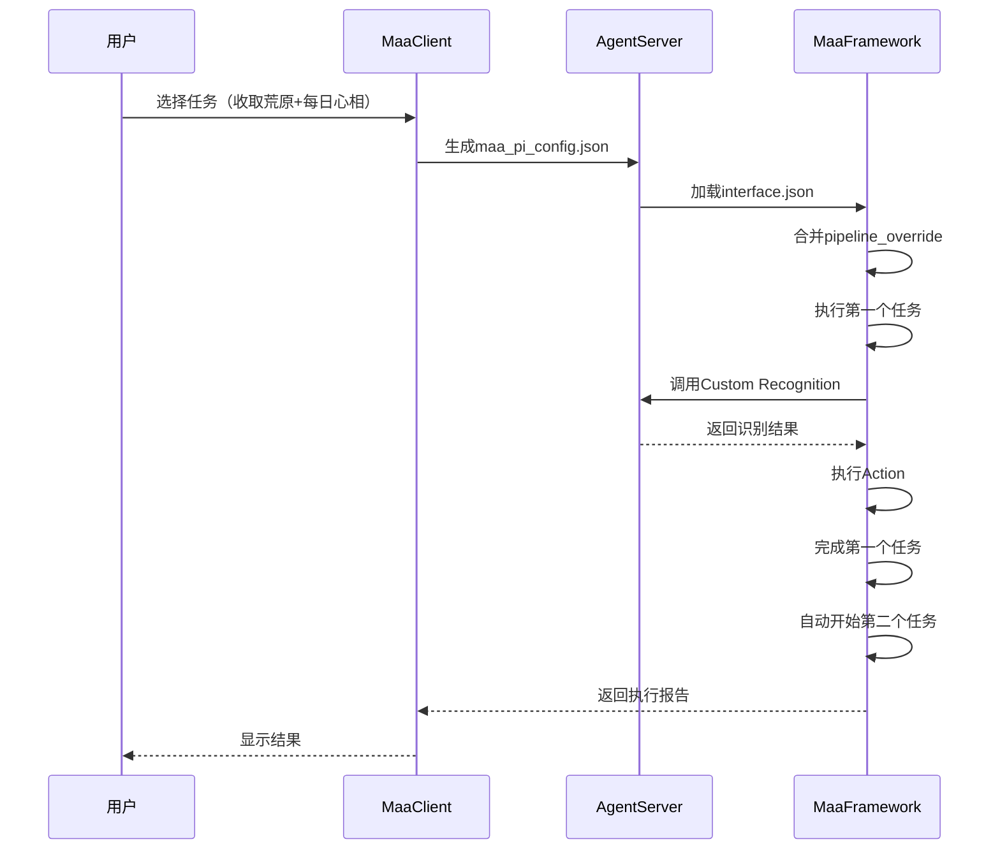

# MaaFramework 深度理解指南

## 🧩 框架本质：Pipeline驱动的声明式系统（非代码驱动）

> **官方简介**：基于图像识别的自动化黑盒测试框架 | An automation black-box testing framework based on image recognition
> **核心公式**：`任务 = 识别(Recognition) + 操作(Action)`  
> **设计哲学**：*用声明代替命令，用组合代替硬编码*
> **官方文档**：<https://maafw.com/docs/3.1-PipelineProtocol>

### ✅ 精准心智模型



### ⚡ 关键执行规则（基于您的指正）

1. **任务独立性**：`maa_pi_config.json` 中定义的任务序列是**并列关系**，一个任务失败不会阻断后续任务
2. **Custom Action本质**：
   - **不是**简单的True/False决策器
   - **是**框架能力的**安全扩展点**，用于实现：
     - 原生不支持的操作（如发送邮件/微信通知）
     - 复杂业务逻辑（如基于多节点结果的决策）
     - 与外部系统集成（如数据库记录）
3. **避免重复造轮子**原则：

   ```python
   # ❌ 错误用法：框架已有Click功能
   def custom_click():
       controller.post_click(100, 100)
       return True
   
   # ✅ 正确用法：实现框架不支持的功能
   def send_notification():
       # 调用企业微信API发送通知
       requests.post("https://qyapi.weixin.qq.com/...", json=payload)
       return True  # 返回执行状态
   ```

---

## 🔑 深度理解的4个核心维度（附示例）

### 1. **Pipeline 与 Interface 的映射关系**

```json
// interface.json (任务入口定义)
{
  "task": [
    {
      "name": "每日签到",
      "entry": "DailySign", // ← 对应 pipeline.json 中的节点
      "resource": ["Official"],
      "option": ["复现次数"]
    }
  ]
}

// pipeline.json (具体执行逻辑)
{
  "DailySign": {
    "next": ["CheckSignInStatus", "PerformSignIn"]
  },
  "CheckSignInStatus": {
    "recognition": "OCR",
    "expected": "今日已签到",
    "action": "StopTask" // 跳过签到
  }
}
```

**关键理解**：`interface.json` 是任务目录，`pipeline.json` 是任务说明书

### 2. **Custom Action/Recognition 的正确使用场景**

根据 `demo3_agent.py` 和协议文档，正确使用模式：

| 场景类型 | 应该使用 | 不应使用 | 示例 |
|----------|----------|----------|------|
| **框架原生支持** | 标准Action | Custom实现 | 点击→`"action":"Click"` |
| **需要外部集成** | Custom Action | 标准Action | 发送邮件→`"custom_action":"SendEmail"` |
| **识别增强** | Custom Recognition | 多节点组合 | 复杂UI分析→`"custom_recognition":"AnalyzeDashboard"` |
| **流程控制** | pipeline节点 | Custom逻辑 | 重试→配置`max_retry`而非Python循环 |

### 3. **Context 对象：框架能力的桥梁**

从 `demo3_agent.py` 提取的关键能力：

```python
def analyze(self, context, argv):
    # 1. 调用框架原生识别
    reco_detail = context.run_recognition("MyCustomOCR", argv.image)
    
    # 2. 动态修改后续流程
    context.override_next(argv.node_name, ["TaskA", "TaskB"])
    
    # 3. 覆盖pipeline参数（全局生效）
    context.override_pipeline({"MyCustomOCR": {"roi": [1, 1, 114, 514]}})
    
    # 4. 创建独立context（局部生效）
    new_context = context.clone()
    reco_detail = new_context.run_recognition("MyCustomOCR", argv.image)
    
    # 5. 直接调用控制器
    context.tasker.controller.post_click(10, 20).wait()
```

**黄金法则**：Custom代码中应通过`context`调用框架能力，而非自行实现基础功能

### 4. **Schema驱动的结构化思维**

通过提供的schema文件，提炼出AI必须理解的核心约束：

```markdown
### 📐 必须内化的结构规则
1. **interface.json 强制字段**（`interface.schema.json`定义）：
   ```json
   {
     "required": ["interface_version", "name", "controller", "resource", "task"],
     "properties": {
       "controller": {
         "items": {
           "required": ["name", "type"],
           "properties": {
             "type": {"enum": ["Adb", "Win32", "PlayCover", "Gamepad"]}
           }
         }
       }
     }
   }
   ```

1. **pipeline.json 节点契约**（`pipeline.schema.json`定义）：

   ```json
   {
     "properties": {
       "recognition": {
         "oneOf": [
           {"$ref": "#/definitions/DirectHitV2"},
           {"$ref": "#/definitions/TemplateMatchV2"},
           {"$ref": "#/definitions/CustomRecognitionV2"}  // ← Custom类型
         ]
       },
       "action": {
         "oneOf": [
           {"$ref": "#/definitions/ClickV2"},
           {"$ref": "#/definitions/CustomActionV2"}  // ← Custom类型
         ]
       }
     }
   }
   ```

```

---

## 🚀 AI深度理解训练包（立即生效）

### 训练1：识别框架原生能力 vs 需要Custom扩展
```markdown
**问题**：需要实现"如果体力不足则购买体力"功能，应该如何设计？
**正确思路**：
1. 框架原生支持：OCR识别体力数值、点击购买按钮 → 用标准节点
2. 需要Custom扩展：计算当前体力值、比较阈值、记录购买次数 → 用Custom Recognition

**Pipeline示例**：
{
  "CheckSanity": {
    "recognition": {
      "type": "Custom",  // ← 需要Custom因为涉及计算
      "param": {
        "custom_recognition": "AnalyzeSanity",
        "threshold": 10  // 低于10点体力需购买
      }
    },
    "next": ["BuySanity"]
  },
  "BuySanity": {
    "action": "Click",  // ← 框架原生支持
    "target": "buy_button"
  }
}
```

### 训练2：理解Context对象的能力边界

```python
# ✅ 正确：通过context使用框架能力
def run(self, context, argv):
    # 获取当前截图
    image = context.tasker.controller.post_screencap().wait().get()
    
    # 调用另一个识别节点
    result = context.run_recognition("OCR_Energy", image)
    
    # 安全的点击（框架处理坐标转换/重试）
    context.tasker.controller.post_click(100, 200).wait()
    return True

# ❌ 错误：绕过框架自行实现
def run(self, context, argv):
    # 错误1：直接使用cv2（忽略框架的分辨率适配）
    import cv2
    img = cv2.imread(...)
    
    # 错误2：自行实现点击（忽略重试/坐标转换）
    import pyautogui
    pyautogui.click(100, 200)
    
    # 错误3：全局变量（破坏任务隔离性）
    global last_click_time
    last_click_time = time.time()
    return True
```

### 训练3：任务配置全流程（从interface到执行）



---

## 📚 最佳实践知识库（AI应背诵的核心原则）

### 何时使用Custom扩展

```markdown
✅ **应该用Custom的场景**：
- 需要调用外部API（微信/邮件/数据库）
- 需要复杂数学计算或业务规则
- 需要访问系统资源（读写文件、网络请求）
- 需要与框架无关的第三方库集成

❌ **不应使用Custom的场景**：
- 基础操作（点击/滑动/输入文本）→ 用标准Action
- 常见识别（模板匹配/OCR/颜色匹配）→ 用标准Recognition
- 简单流程控制（重试/条件跳转）→ 用pipeline配置
- 状态管理 → 用框架上下文
```

### Pipeline设计黄金法则

```markdown
1. **单一职责原则**：每个节点只做一件事
   - ❌ 错误："CheckAndClickButton" 节点
   - ✅ 正确："CheckButtonVisibility" + "ClickButton" 两个节点

2. **优先使用标准节点**：Custom代码应<20%的总节点数

3. **参数化而非硬编码**：
   ```json
   // ❌ 硬编码
   "roi": [100, 200, 300, 400]
   
   // ✅ 参数化（通过option覆盖）
   "roi": "{button_roi}"
   ```

1. **防御性设计**：
   - 必须设置`timeout`（避免死锁）
   - 必须处理`on_error`（定义失败策略）
   - 避免`max_retry=-1`（无限重试）

```

---

## 💡 为什么这个指南更有效？

1. **基于真实代码**：完全依据您提供的`demo3_agent.py`和schema文件
2. **修正关键误解**：明确Custom Action的正确使用场景
3. **可视化心智模型**：用mermaid图表替代抽象描述
4. **聚焦决策边界**：提供清晰的"何时用/不用Custom"判断标准
5. **Schema驱动**：利用框架自带的校验规则约束AI生成

> **最终检验**：当AI生成代码时，应能回答：  
> *"这个功能在`pipeline.schema.json`中有对应类型吗？如果有，为什么不用标准Action？"*

