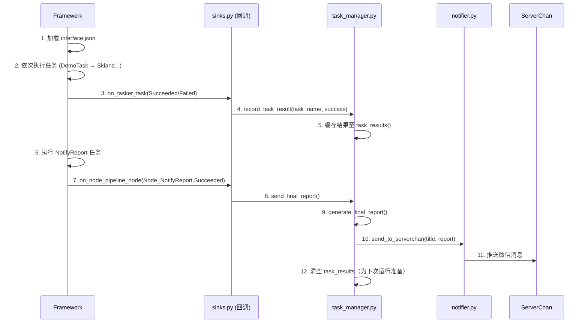

# MaaFramework 自动化签到项目完整开发指南  

*——基于回调机制的无侵入式任务管理系统（SRMP_AutoSign）*  
基于 [MaaFramework](https://github.com/MaaXYZ/MaaFramework) 构建一个支持多 App 自动签到的个人工具
使用 **Agent 模式 + Pipeline 驱动**，Python 用于补充逻辑（如状态检查、日志、推送），核心流程由 JSON Pipeline 定义。

> **文档版本**: v1.2  
> **最后更新**: 2026-02-12  
> **核心理念**: *配置驱动、模块解耦、回调优先、零侵入业务逻辑*  

---

## 🔗 关键文档参考

- 官方 GitHub：<https://github.com/MaaXYZ/MaaFramework>  
- 中文文档：<https://maafw.com/docs/1.1-QuickStarted>  
- Agent 自定义动作：<https://maafw.com/docs/3.2-AgentCustomAction>  
- 回调协议：<https://maafw.com/docs/2.3-CallbackProtocol>  
- DeepWiki: <https://deepwiki.com/MaaXYZ/MaaFramework>
- Server酱3 推送文档：<https://doc.sc3.ft07.com/zh/serverchan3>  

## 📌 一、项目全景概览

### 1.1 项目定位

- **核心特性**:
  - ✅ **无侵入式设计**: 业务 Pipeline 与状态管理完全解耦
  - ✅ **全局结果聚合**: 所有任务完成后自动生成汇总报告
  - ✅ **ServerChan 通知**: 通过ServerChan推送执行结果
  - ✅ **按天日志归档**: 自动管理历史执行记录
  - ✅ **模板化扩展**: 新增签到任务仅需配置 JSON + 资源文件

### 1.2 技术栈

| 组件 | 说明 | 版本要求 |
|------|------|----------|
| **MaaFramework** | 核心自动化框架 | ≥ v5.0 |
| **Python** | 业务逻辑实现 | ≥ 3.10 |
| **ServerChan SDK** | 消息推送 | 最新版 |
| **OCR 模型** | 文字识别 | PaddleOCR |
| **ADB** | Android 设备控制 | 1.0.41+ |

---

## 🌳 二、项目结构深度解析

```bash
SRMP_AutoSign/
├── agent/                          # 【核心】Agent 业务逻辑层
│   ├── main.py                     # Agent 启动入口（极简：仅注册回调+启动）
│   ├── task_manager.py             # 全局任务状态管理器（结果聚合+报告生成）
│   ├── sinks.py                    # 回调处理器（Tasker/Context 事件监听）
│   ├── logger.py                   # 按天日志系统（自动归档至 assets/logs/）
│   ├── notifier.py                 # ServerChan 通知封装
│   ├── my_action.py                # 【扩展】自定义动作（如 error_handler）
│   └── my_reco.py                  # 【扩展】自定义识别器
├── assets/                         # 【核心】框架资源配置
│   ├── interface.json              # 任务编排主配置（定义执行顺序+资源路径）
│   ├── resource/
│   │   ├── pipeline/               # 任务流程定义（JSON 格式）
│   │   │   ├── DemoTask.json       # 演示任务（新手入门）
│   │   │   ├── Skland.json         # 森空岛签到（生产示例）
│   │   │   ├── NotifyReport.json   # 全局报告触发节点（关键！）
│   │   │   └── my_task.json        # 用户自定义任务模板
│   │   ├── base/                   # 资源文件（模板图、音频等）
│   │   └── model/ocr/              # OCR 模型配置
│   └── MaaCommonAssets/            # Maa 官方通用资源（图标/字体等）
├── tools/                          # 辅助工具
│   ├── app_sign_template.json      # 通用签到 Pipeline 模板（含占位符）
│   ├── app_sign_template.md        # 模板使用指南（含变量替换表）
│   ├── migrate_pipeline_v5.py      # Pipeline 版本迁移脚本
│   └── requirements.txt            # Python 依赖清单
├── docs/zh_cn/                     # 中文文档
│   └── 个性化配置.md               # 配置详解（ROI/关键词等）
├── check_resource.py               # 资源完整性校验脚本
├── README.md                       # 项目指引
└── How to work with MaaFw.md       # MaaFramework 核心机制解读
```

---

## 🔑 三、核心机制详解（新手必读）

### 3.1 为什么需要“专用结束任务”？

| 问题 | 原因 | 本项目方案 |
|------|------|------------|
| 框架无“所有任务完成”事件 | MaaFramework 为单任务回调设计 | 在 `interface.json` 末尾添加 `NotifyReport` 任务 |
| 无法预知任务总数 | 任务可能动态增减 | 通过监听 `NotifyReport` 节点完成事件触发全局报告 |
| 避免计数器同步问题 | 多线程环境下易出错 | 无状态设计：仅当特定节点完成时触发 |

✅ **关键设计**：  
`NotifyReport` 任务本身**不执行任何操作**，仅作为“信号灯”触发全局报告生成。

### 3.2 任务执行全流程（含回调链）



### 3.3 关键文件职责速查表

| 文件 | 核心职责 | 修改频率 | 新手注意 |
|------|----------|----------|----------|
| `agent/main.py` | 启动 Agent + 注册回调 | 极低 | **切勿添加业务逻辑** |
| `agent/sinks.py` | 事件监听中枢 | 低 | 修改需同步更新 interface.json |
| `agent/task_manager.py` | 结果聚合+报告生成 | 中 | 新增统计维度在此扩展 |
| `agent/logger.py` | 按天日志管理 | 低 | 路径硬编码：`../assets/logs/{date}.json` |
| `assets/interface.json` | 任务编排总控 | 高 | **NotifyReport 必须放最后** |
| `assets/resource/pipeline/NotifyReport.json` | 全局报告触发器 | 极低 | 仅含一个 DirectHit 节点 |
| `tools/app_sign_template.json` | 签到任务模板 | 中 | 替换 `{{}}` 占位符生成新任务 |

---

## 🛠️ 四、快速上手指南（5分钟部署）

### 步骤1：环境准备

```bash
# 安装 Python 依赖
pip install -r tools/requirements.txt

# 验证 MaaFramework 环境
python check_resource.py  # 检查资源完整性
```

### 步骤2：配置通知（必做）

1. 编辑 `assets/config/serverchan.json`(已列入.gitignore):

   ```json
   {
     "sendkey": "YOUR_SERVERCHAN_SENDKEY"  // 从 https://sc3.ft07.com/ 获取
   }
   ```

2. 测试通知（可选）:

   ```python
   from agent.notifier import send_to_serverchan
   send_to_serverchan("测试", "环境配置成功！")
   ```

### 步骤3：添加新签到任务（三步法）

1. **复制模板**  
   `cp tools/app_sign_template.json assets/resource/pipeline/MyApp.json`

2. **替换占位符**（参考 `tools/app_sign_template.md`）  

   ```json
   // MyApp.json
   "MyApp_SignIn": { ... },
   "MyApp_CheckAlreadySigned": {
     "recognition": {
       "param": {
         "roi": [200, 300, 400, 80],  // 用 MaaTool 调整
         "expected": "今日已签到"
       }
     },
     ...
   }
   ```

3. **注册到主流程**  
   编辑 `assets/interface.json` → `task` 数组末尾（**NotifyReport 前**）:

   ```json
   {
     "name": "我的应用签到",
     "entry": "MyApp_SignIn"
   }
   ```

### 步骤4：启动执行

```bash
# 生成 socket_id（框架要求）
python -c "import uuid; print(uuid.uuid4())"

# 启动 Agent（替换为实际 socket_id）
python agent/main.py 41e0a7de-8835-481a-9fa7-34d7965e635c
```

---

## 📦 五、关键配置详解

### 5.1 `assets/interface.json` 核心结构

```json
{
  "interface_version": 2,
  "task": [
    {"name": "DemoTask", "entry": "DemoTask"},
    {"name": "森空岛签到", "entry": "Skland_SignIn"},
    // ... 其他业务任务 ...
    {"name": "全局报告", "entry": "Node_NotifyReport"}  // ⚠️ 必须放最后！
  ],
  "agent": {
    "child_exec": "python",
    "child_args": ["./../agent/main.py"]  // 相对路径指向 main.py
  }
}
```

### 5.2 `NotifyReport.json`（全局报告触发器）

```json
{
  "Node_NotifyReport": {
    "recognition": "DirectHit",  // 无条件命中
    "action": "DoNothing",       // 不执行操作
    "focus": {
      "Node.PipelineNode.Starting": "📤 准备生成全局执行报告...",
      "Node.PipelineNode.Succeeded": "✅ 触发全局报告发送"
    },
    "next": []
  }
}
```

> 💡 **为什么用 DirectHit?**  
> 确保该节点**必然执行**，且不依赖任何界面状态，作为可靠的“结束信号”。

### 5.3 日志系统工作原理 (`logger.py`)

- **存储路径**: `assets/logs/2026-02-12.json`
- **文件结构**:

  ```json
  {
    "date": "2026-02-12",
    "run_start": "14:30:22",
    "tasks": {
      "DemoTask": {
        "status": "success",
        "last_run": "14:30:45",
        "reward": "星琼×60"
      },
      "Skland_SignIn": {
        "status": "failed",
        "last_run": "14:31:10",
        "error": "按钮未找到"
      }
    }
  }
  ```

- **自动轮转**: 每日生成新文件，避免单文件过大
- **线程安全**: 内置锁机制防止并发写入冲突

---

## 🧪 六、调试与排错指南

### 常见问题速查

| 现象 | 根本原因 | 解决方案 |
|------|----------|----------|
| 任务执行但无日志 | `logger.py` 初始化参数错误 | 检查 `SignInLogger()` 是否无参调用 |
| 全局报告未发送 | `NotifyReport` 未放 task 末尾 | 检查 `interface.json` 任务顺序 |
| ServerChan 无推送 | sendkey 未配置/失效 | 检查 `assets/config/serverchan.json` |
| OCR 识别失败 | ROI 坐标不准/模型缺失 | 用 MaaTool 调整 ROI + 检查 model/ocr |
| 回调未触发 | sinks.py 未导入 main.py | 确保 `from sinks import ...` 在 main.py 顶部 |

### 调试技巧

1. **查看实时日志**:

   ```bash
   tail -f assets/logs/$(date +%Y-%m-%d).json
   ```

2. **启用框架调试模式**（临时修改 `main.py`）:

   ```python
   Toolkit.init_option("./", verbose=True)  # 输出详细框架日志
   ```

3. **单独测试通知**:

   ```python
   python -c "from agent.notifier import send_to_serverchan; send_to_serverchan('测试', '调试消息')"
   ```

---

## 🌟 七、最佳实践与扩展建议

### ✅ 推荐做法

- **任务命名规范**: `应用名_动作` (如 `Skland_SignIn`, `Miyoushe_CheckIn`)
- **ROI 坐标管理**: 在 `docs/zh_cn/个性化配置.md` 中记录各设备适配坐标
- **模板复用**: 新增任务优先基于 `tools/app_sign_template.json` 修改
- **错误隔离**: 业务任务失败不应阻塞全局报告发送（当前设计已保障）

### 🔮 扩展方向

| 需求 | 实现思路 | 涉及文件 |
|------|----------|----------|
| 失败重试机制 | 在 Pipeline 中添加重试节点 | `my_task.json` |
| 多设备并行 | 启动多个 Agent 实例 + 独立 socket_id | `main.py` (参数化) |
| 企业微信通知 | 扩展 `notifier.py` 支持多通道 | `notifier.py` |
| Web 管理界面 | 用 Flask 暴露 task_manager API | 新增 `web/` 目录 |

---

## 📚 八、附录：关键文档索引

| 文档 | 位置 | 用途 |
|------|------|------|
| **Pipeline 模板使用指南** | `tools/app_sign_template.md` | 新增签到任务必读 |
| **MaaFramework 核心机制** | `How to work with MaaFw.md` | 理解回调/节点/资源加载 |
| **个性化配置详解** | `docs/zh_cn/个性化配置.md` | ROI/关键词/坐标调整指南 |
| **开发规范** | `Dev.md` | 代码风格/提交规范/测试要求 |
| **资源迁移脚本** | `tools/migrate_pipeline_v5.py` | 旧版 Pipeline 升级工具 |

---

## 💬 结语：给新成员的寄语

> “本项目的核心哲学是：**让框架做框架的事，让配置做配置的事，让代码做代码的事**。  
> 你不需要成为 MaaFramework 专家，只需理解三点：  
> 1️⃣ 任务流程由 `interface.json` 编排  
> 2️⃣ 业务逻辑在 Pipeline JSON 中定义  
> 3️⃣ 全局行为通过回调 (`sinks.py`) 扩展  
> 遇到问题？先看日志 → 再查文档 → 最后改代码。欢迎加入自动化之旅！”  

---

✅ **文档验证清单**（使用前确认）  

- [ ] 已配置 `assets/config/serverchan.json`  
- [ ] `interface.json` 中 `NotifyReport` 位于 task 数组末尾  
- [ ] `agent/main.py` 已导入 `sinks.py` 中的回调类  
- [ ] 资源文件路径与 `interface.json` 中声明一致  

> 本文档持续更新，最新版请查阅项目根目录 `PROJECT_GUIDE.md`  
> **贡献指南**: 修改后请同步更新 `CLAUDE.md`（上下文摘要）与本指南  
> **遇到卡点？** 优先查阅 `How to work with MaaFw.md` 中的“回调机制”章节

## 鸣谢

本项目由 **[MaaFramework](https://github.com/MaaXYZ/MaaFramework)** 强力驱动！

感谢以下开发者对本项目作出的贡献（下面链接改成你自己的项目地址）:
[](https://github.com/ShiroMaple/SRMP_AutoSign/graphs/contributors)
